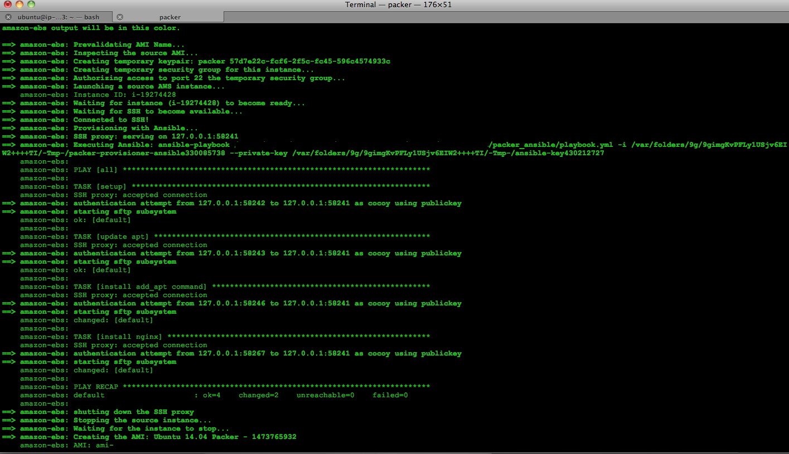

# Packer Sample with Ansible 

Illustrate how to use Ansible as provisioner to Hashicorp''s Packer on creating AMI on EC2.

## Getting Started

These instructions will get you a copy of the project up and running on your local machine for development and testing purposes. 

### Prerequisities

What things you need to install the software and how to install them

Packer, Ansible 

### Post related to this repository:
http://www.capsunlock.net/2016/09/packer-for-building-ami-on-ec2-and-beyond.html

### Runtime 
  

## Authors

* **Rodney Quillo** - *Initial work* - [cocoy](https://github.com/cocoy)

## License

This project is licensed under the MIT License - see the [LICENSE.md](LICENSE.md) file for details

## Acknowledgments

* Hat tip to anyone who's code was used
* Inspiration
* etc

